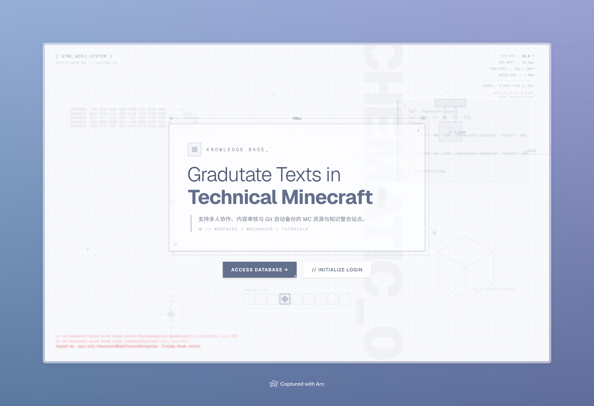

# Graduate Texts in Minecraft

A Technical Minecraft online textbook, written collaboratively and community-driven.

[Website](https://beta.techmc.wiki)

## Repositories

This repo contains solely the website's code.

All other data (e.g., articles) can be found from other repos under the [orgranization](https://github.com/orgs/gtmc-dev/repositories).

## Development Setup

### First-time Setup

```bash
git clone https://github.com/gtmc-dev/gtmc.git
cd gtmc
pnpm install  # Automatically initializes submodules
```

### Submodule Management

The Articles content is managed as a Git submodule. Use these commands:

```bash
# Check submodule status
pnpm articles:status

# Update to latest articles
pnpm articles:update

# Reinitialize if needed
pnpm articles:init
```

**Note:** The submodule is version-locked. After pulling changes that update the submodule reference, run `pnpm articles:update`.

## License

The site's source code is distrubuted with the Apache 2.0 license.

All articles are licensed under CC-BY-NC-SA 4.0.
